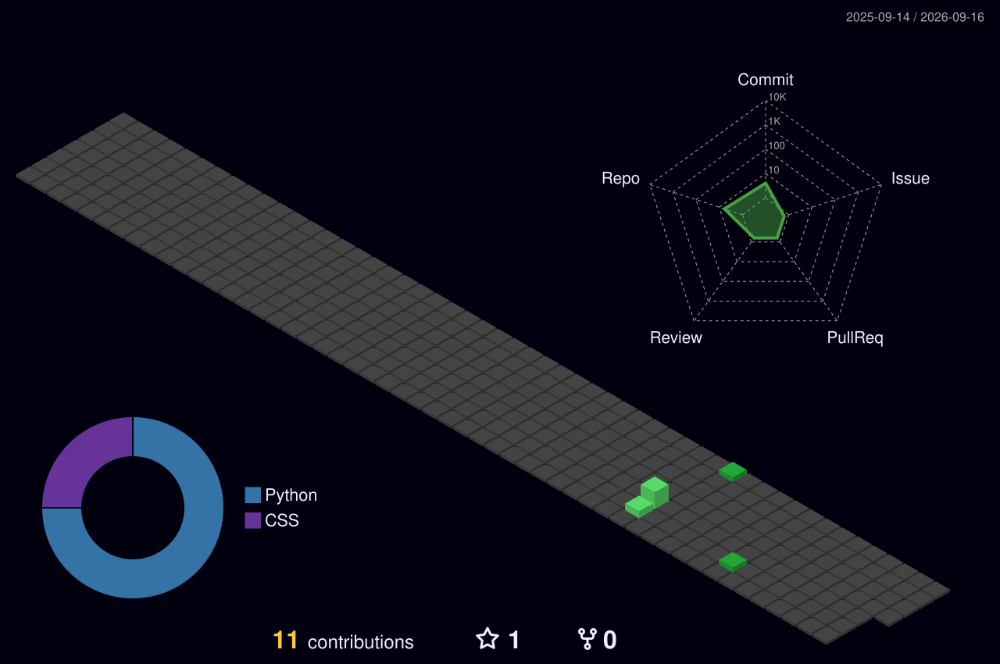

<!-- ═══════════════════════════════════════════════════════════════════════════ -->
<!-- ░░░░░░░░░░░░░░░░░░░░░░░░░░░░░░░░░░░░░░░░░░░░░░░░░░░░░░░░░░░░░░░░░░░░░ -->
<!--                     MOBEEN MANSOOR — GITHUB PROFILE                      -->
<!-- ░░░░░░░░░░░░░░░░░░░░░░░░░░░░░░░░░░░░░░░░░░░░░░░░░░░░░░░░░░░░░░░░░░░░░ -->
<!-- ═══════════════════════════════════════════════════════════════════════════ -->

<!-- WAVING HEADER -->


<!-- GLITCH ANIMATED HEADER -->
<div align="center">
  
</div>

<!-- TYPING ANIMATION -->
<div align="center">
  <a href="https://git.io/typing-svg">
    
  </a>
</div>

<br/>

<!-- PROFILE BADGES -->
<div align="center">
  
  &nbsp;
  <a href="https://github.com/MobeenMansoor?tab=followers">
    
  </a>
  &nbsp;
  <a href="https://github.com/MobeenMansoor?tab=repositories">
    
  </a>
</div>

<br/>

<!-- MATRIX DIVIDER -->


<br/>

<!-- ═══════════════════════ SYSTEM PROFILE ═══════════════════════ -->

<div align="center">
  <h2>
    
    &nbsp; SYSTEM://PROFILE &nbsp;
    
  </h2>
</div>

```js
// ═══════════════════════════════════════════════════════
//  $ cat /home/mobeen/about.json
// ═══════════════════════════════════════════════════════

const MobeenMansoor = {
    identity: {
        name:       "Mobeen Mansoor",
        title:      "AI Engineer in Training",
        education:  "BS Artificial Intelligence — 2nd Year",
        location:   "Pakistan 🇵🇰",
    },
    
    domains: [
        "Deep Learning",
        "Neural Networks", 
        "Computer Vision",
        "Natural Language Processing",
        "Machine Learning",
    ],

    currentlyTraining: {
        model:      "self",
        optimizer:  "curiosity",
        lossFunc:   "imposter_syndrome.backward()",
        epochs:     Infinity,
    },
    
    philosophy: "Data is the new fuel. Intelligence is the new fire.",
};
```

<br/>

<!-- NEURAL NETWORK ANIMATION -->
<div align="center">
  
</div>

<br/>

<!-- MATRIX DIVIDER -->


<br/>

<!-- ═══════════════════════ TECH STACK ═══════════════════════ -->

<div align="center">
  <h2>⚡ TECH_STACK.initialize() ⚡</h2>
  <p><em><code>// Tools I wield in the quest for artificial general intelligence</code></em></p>
</div>

<br/>

<div align="center">
  
  <!-- Languages -->
  <h4>▸ LANGUAGES</h4>
  
  
  
  
  

  <br/><br/>

  <!-- AI / ML Frameworks -->
  <h4>▸ AI / ML FRAMEWORKS</h4>
  
  
  
  
  
  

  <br/><br/>

  <!-- Data & Tools -->
  <h4>▸ DATA & TOOLS</h4>
  
  
  
  
  
  
  

</div>

<br/>

<!-- MATRIX DIVIDER -->


<br/>

<!-- ═══════════════════════ GITHUB ANALYTICS ═══════════════════════ -->

<div align="center">
  <h2>📊 ANALYTICS.render() 📊</h2>
</div>

<br/>

<div align="center">
  <!-- GitHub Stats -->
  
  &nbsp;
  <!-- Streak Stats -->
  
</div>

<br/>

<div align="center">
  <!-- Top Languages -->
  
</div>

<br/>

<!-- Activity Graph -->
<div align="center">
  
</div>

<br/>

<!-- GitHub Trophies -->
<div align="center">
  
</div>

<br/>

<!-- MATRIX DIVIDER -->


<br/>

<!-- ═══════════════════════ PAC-MAN CONTRIBUTION ═══════════════════════ -->

<div align="center">
  <h2>👾 CONTRIBUTION_GRID.pacman() 👾</h2>
  <p><em><code>// Pac-Man is devouring my contribution graph — WAKA WAKA</code></em></p>
</div>

<br/>

<div align="center">
  <picture>
    <source media="(prefers-color-scheme: dark)" srcset="https://raw.githubusercontent.com/MobeenMansoor/MobeenMansoor/output/pacman-contribution-graph-dark.svg" />
    <source media="(prefers-color-scheme: light)" srcset="https://raw.githubusercontent.com/MobeenMansoor/MobeenMansoor/output/pacman-contribution-graph.svg" />
    
  </picture>
</div>

<br/>

<!-- MATRIX DIVIDER -->


<br/>

<!-- ═══════════════════════ 3D CONTRIB CALENDAR ═══════════════════════ -->

<div align="center">
  <h2>🌐 CONTRIBUTION_MAP.render3D() 🌐</h2>
  <p><em><code>// Isometric visualization of commit topology</code></em></p>
</div>

<br/>

<div align="center">
  
</div>

<br/>

<!-- MATRIX DIVIDER -->


<br/>

<!-- ═══════════════════════ CONNECT ═══════════════════════ -->

<div align="center">
  <h2>🔗 NETWORK.connect() 🔗</h2>
  <p><em><code>// Establishing secure connection...</code></em></p>
</div>

<br/>

<div align="center">
  <a href="https://linkedin.com/in/mobeenmansoor2005" target="_blank">
    
  </a>
  &nbsp;&nbsp;
  <a href="mailto:mxb33n99@gmail.com">
    
  </a>
  &nbsp;&nbsp;
  <a href="https://github.com/MobeenMansoor" target="_blank">
    
  </a>
</div>

<br/>

<!-- ═══════════════════════ QUOTE ═══════════════════════ -->

<div align="center">

```
╔══════════════════════════════════════════════════════════════╗
║                                                              ║
║   "The question is not whether intelligent machines can      ║
║    have any emotions, but whether machines can be            ║
║    intelligent without any emotions."                        ║
║                                        — Marvin Minsky       ║
║                                                              ║
╚══════════════════════════════════════════════════════════════╝
```

</div>

<br/>

<!-- CIRCUIT FOOTER -->
<div align="center">
  
</div>

<!-- WAVING FOOTER -->


<!-- ═══════════════════════════════════════════════════════════════════════════ -->
<!--                         END OF TRANSMISSION                               -->
<!-- ═══════════════════════════════════════════════════════════════════════════ -->
